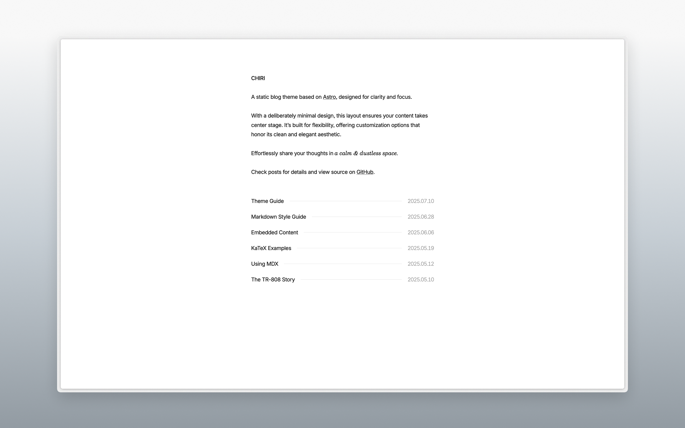
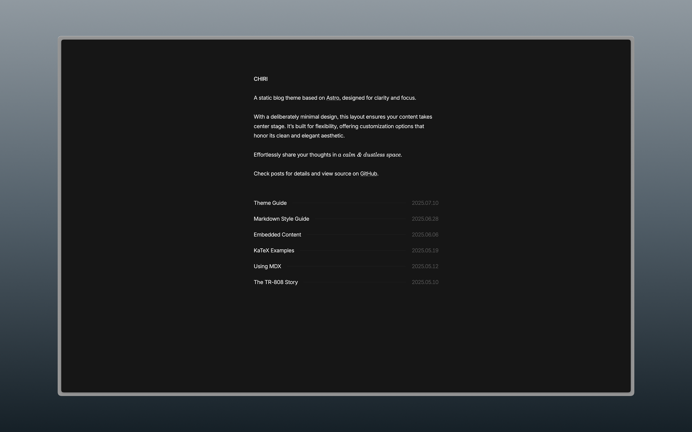

# Dr. TMA Pai Endowment Chair - ITIS




Official website for Dr. TMA Pai Endowment Chair - ITIS, built with [Astro](https://astro.build).

## Features

- [x] Build with Astro
- [x] Responsive
- [x] Light / Dark mode
- [x] MDX
- [x] KaTeX
- [x] Sitemap
- [x] OpenGraph
- [x] RSS, Atom, and JSON Feed
- [ ] Pagination

## Getting Started

1. Clone this repository and run the following commands:

   ```bash
   git clone <your-repo-url>

   cd <your-repo-name>

   pnpm install

   pnpm dev
   ```

2. Edit `src/config.ts` and `src/content/about/about.md` to your liking.

3. Use `pnpm new <title>` to create new posts, or add your posts to `src/content/posts`.

### Organizing posts

Every post includes three discovery fields in its frontmatter:

```yaml
category: 'Models & Training'
description: 'A concise standfirst shown on the front page and in search results.'
topics: ['Fine-tuning', 'LoRA', 'Training']
```

Choose one category from `Models & Training`, `Inference & Deployment`, `Hardware & Systems`, or
`Ecosystems & Tooling`. Keep topics specific and use two or three per post. Set `featured: true` on
the single article that should lead the newspaper-style front page.

### Feeds

Every published post is syndicated in full text at three endpoints, all generated from
`src/utils/feed.ts` and pre-rendered at build time:

| Path         | Format        |
| ------------ | ------------- |
| `/rss.xml`   | RSS 2.0       |
| `/atom.xml`  | Atom 1.0      |
| `/feed.json` | JSON Feed 1.0 |

`/feed`, `/feed.xml`, `/rss`, and `/index.xml` redirect to `/rss.xml`; `/atom` redirects to
`/atom.xml`. All three are advertised for autodiscovery in `<head>`.

Entries carry the rendered post — not the Markdown source — so KaTeX math ships as MathML, footnotes
and headings link back to the canonical URL, and every asset reference is absolute.

The `viz/*` diagram components draw with CSS grid and custom properties, which a feed reader never
receives. They are rasterised to WebP by `bun run viz-figures`, which renders each post in headless
Chromium, screenshots every diagram into `public/feeds/figures/`, and records them in
`src/data/viz-figures.json`. Those images
are committed, so the site build never needs a browser — but **re-run `bun run viz-figures` after
changing a `viz/*` component**. The feed hashes each diagram's text against the manifest and falls
back to a captioned link, warning during the build, whenever an image is missing or stale. Data
tables are kept as inline markup rather than pictures.

## Commands

- `pnpm new <title>` - Create a new post (use `_title` for drafts)
- `pnpm viz-figures` - Re-render the feed images for `viz/*` diagrams
- `pnpm dev` - Start development server
- `pnpm build` - Build for production

## License

MIT
